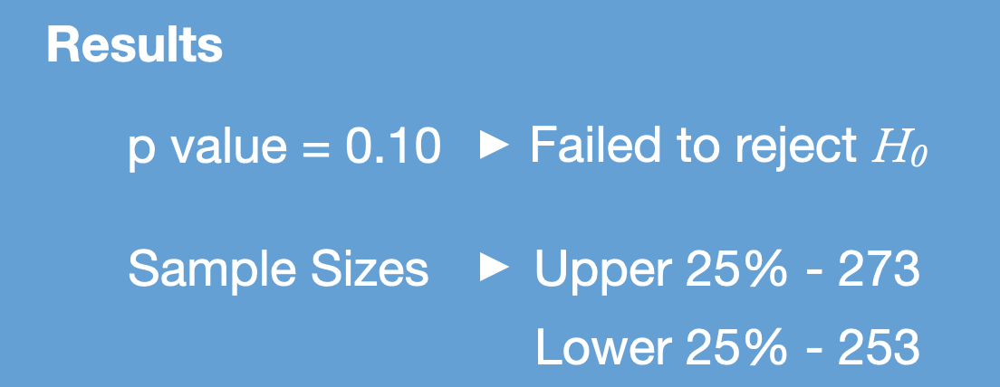

# Social Connectedness and COVID-19 Spread

#### **Project Status: [Completed]**

## Table of Contents 
1) Project Obective
2) Methods
3) Technologies Used
4) Data Exploration
5) Hypothesis Testing
6) Conclusions and Next Steps

## Project Objective
Fascinated by social connectedness and curious about COVID-19 spread, I explored whether a link exists between U.S. counties' social connectedness and their incidence of COVID-19. I leveraged county-level social connectedness data and COVID-19 spread data to explore what relationship, if any, exists between the two.

### Hypothesis: 
I hypothesized that U.S. counties with greater social connectedness have higher rates of COVID-19 spread. 

### Methods
    - Exploratory Data Analysis
    - Social Network Analysis, Graph Analysis
    - Geospacial Information Systems
    - Hypothesis Testing

### Technologies Used 

## Data Exploration
[Facebook Data For Good](https://dataforgood.fb.com/tools/social-connectedness-index/) publishes the Social Connectedness Indicator (SCI), a relative probability on whether individuals from two U.S. counties are friends on Facebook. The range of the SCI is between 1 and 1 billion. To better facilitate visualizing this dataset, I transformed the metric using log base 10 to use throughout my analysis. 

**Figure 1:** Distribution of log SCI Across U.S. Counties

Taking two U.S. counties, San Francisco County and Kern County as examples, the utility of the SCI dataset is evident in Figures 2 and 3. Figure 2 plots the SCI for each county connected to San Francisco County. Darker blue counties indicate a more likely friendship tie between an individual in that county and San Francisco County. Urban areas in the West, South, southern Florida, and the Northeast are more likely to have connections to individuals residing in San Francisco County.

**Figure 2:** County-County Connections to San Francisco County, California

Contrast this with a more rural county in California, Kern County, which has more connections to more rural areas throughout the West, Southeast, and western Texas, shown in Figure 3.

**Figure 3:** County-County Connections to Kern County, California

With the SCI data, I layered on COVID-19 cases per capita and generated network graphs for two samples of counties - the lower 25% of SCI counties and the upper 25% of connected counties. I hypothesized that lower connected counties would have fewer COVID-19 cases per capita than higher-connected counties.

Figure 4 illustrates a sample of 2,000 county pairs with the lowest SCI. Each node is scaled for the number of COVID-19 cases per capita. The mean number of cases per capita of this sample is 4.5.

**Figure 4:** Lower 25% of SCI counties, with nodes sized for COVID-19 cases per capita

Figure 5 represents a sample of 2,000 county pairs with the highest SCI. Again, each node is scaled for the number of COVID-19 cases per capita. The mean cases per capita of this sample is 3.5.

Interestingly, the average number of cases per capita in the upper 25% sample is lower than the sample from the lower 25%. To further explore this observation, I performed a hypothesis test. 

**Figure 5:** Upper 25% of SCI counties, with nodes sized for COVID-19 cases per capita

## Hypothesis Testing
I conducted a two sample, one-sided t-test that compared a sample of counties with the lowest SCI to a sample of counties with the highest SCI. The hypotheses were:

With a p-value less than the selected significance level of 0.05, I failed to reject the null hypothesis. These results ran counter to my initial expectation and hypothesis, but a few reasons could explain the results.

## Analysis
### Why Might Higher Connected Counties Have Fewer Infections per Capita?
1) **We're too late in the pandemic to rely on social networks as disease vectors.** COVID-19 is far too widespread now to suggest that an individual's social network could help predict the direction of the disease. As of December 2020, we are well past the point where an individual's personal connections are the main vector of disease spread. Analogous to this is the fact that contact tracing is essentially useless at this point, with the exception of smaller isolated settings like university campuses.
2) **Demographic differences exist in higher connected counties** Research has demonstrated that higher connected counties, especially when connected to counties that are more than 100 miles away, have higher levels of income, education, and social mobility. It's also possible that such factors influence political and cultural leanings and therefore the degree to which individuals adhere to COVID-19 restrictions. 

## Additional Study
Moving forward, I would like to examine these data using a timeseries approach starting earlier in the pandemic when an individual's social network could have had a greater influence on the direction of the disease. I would also like to examine these data cut by demographic variables including age, income, education levels, and political orientation using voting records. Doing so might offer a more nuanced understanding of the role network data can play in prediction how the social connections of a given county's residents might predict disease spread amongst the county population.

## Contact
anthonyschultz@gmail.com